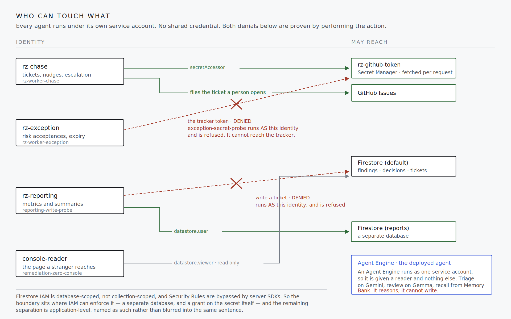

# Remediation Zero

An autonomous agent fleet that owns the vulnerability remediation lifecycle for a one-person security team.

Built for the All Things Agentic Hackathon, Fortified Enterprise Fleet track.

[](https://github.com/Ayliea/remediation-zero/actions/workflows/ci.yml)
[](LICENSE)

**[Open the console](https://remediation-zero-console-978104855285.us-central1.run.app)** ·
**[Agent Engine proof (project access required)](https://console.cloud.google.com/vertex-ai/agents/agent-engines/locations/us-central1/agent-engines/3119663582942330880/playground?project=remediation-zero)** ·
[Architecture](docs/architecture.png) · [Who can touch what](docs/identities.png) · [Demo runbook](docs/DEMO.md)

---

## Judge it in 90 seconds

1. **[Open the live evidence ledger](https://remediation-zero-console-978104855285.us-central1.run.app).** The first screen shows the real/scenario clock pair, the latest rescan's 106 confirmed remediations beside 102 findings it refuses to call fixed, and the human queue.
2. **[Open the strongest tracker exemplar](https://github.com/Ayliea/remediation-zero-tickets/issues/24).** It shows a ratified high-severity decision, two nudges, and evidence-backed closure by `rescan-01`; the remaining linked issues expose the broader trail.
3. **[Inspect the architecture](docs/architecture.png).** The important edges are the gates: Model Armor before reasoning, Gemma review before commit, coverage evidence before closure, and a read-only reporting boundary proven by a denied write.
4. **Watch the video for the deployed-agent proof.** The [Agent Engine playground](https://console.cloud.google.com/vertex-ai/agents/agent-engines/locations/us-central1/agent-engines/3119663582942330880/playground?project=remediation-zero) requires access to the Google Cloud project; the recording asks for `RZ-0101`, shows cross-family adjudication, and shows what the agent is unable to change.

The committed scenario starts with **400 findings across 60 assets and 12 accountable owners**—the kind of backlog a one-person security team cannot manually re-triage and chase every week. The value is not another vulnerability score. It is continuity: the fleet preserves the evidence, disagreement, ownership, deadlines, exceptions, delivery attempts, and rescan proof while the analyst sees only decisions that genuinely require judgment.

| Proof signal | Measured result | Why it matters |
|---|---:|---|
| Starting workload | 400 findings · 60 assets · 12 owners | Large enough that weekly manual re-triage is the failure mode |
| Adversarial gate | 65% of proposals rejected · 53% of findings ratified | The second model changes outcomes instead of rubber-stamping them |
| Rescan reconciliation | 106 confirmed resolved · 102 unverifiable kept open | Missing scan coverage cannot manufacture remediation |
| Regression suite | 623 tests | The safety claims are executable, not presentation-only |

---

## What's unusual here

Five claims. Each one is checkable by someone who did not write this, and the
command that checks it is given, because a claim a reader has to take on faith
is worth less than one they can break.

- **The reporting agent is structurally unable to write a ticket — and the
  proof performs the forbidden action rather than describing it.** A Cloud Run
  job whose service account *is* that identity attempts the write and reports
  the denial. Two of the four checks expect ALLOWED: an identity that can write
  nothing proves only that it is broken, so the control is that the boundary
  falls in a specific place. → `./scripts/verify-controls.sh`

- **Every decision is challenged by a reviewer on a different model family, and
  it disagrees.** It rejects 65% of proposals and ratifies 53% of findings —
  two different denominators, both reported, because a rejected proposal is
  re-proposed once. The rate is reported rather than tuned
  away, because a reviewer that ratifies everything is indistinguishable from
  having no reviewer. → `./scripts/tick.sh --cycle 1 --limit 3`

- **The elapsed time is real and cannot be manufactured.** One orchestrator
  session created `2026-08-27T01:04:38Z` remains addressable in Agent Engine. Every record carries
  both `real_ts`, which is wall clock and never falsified, and `sim_ts`, which
  is scenario. `advance()` raises in real mode and there is no API that sets
  `real_ts`. → the two clocks at the top of the console

- **It files real tickets in a real tracker.** Chase opens a GitHub issue
  carrying the ratified severity, the deadline, the specific remediation and
  the reviewer's own reason for accepting it, then comments as it nudges and
  escalates. → [the issues it has filed](https://github.com/Ayliea/remediation-zero-tickets/issues?q=is%3Aissue)

- **The deployed agent answers, and tells you what it cannot do.** It reads a
  finding, delegates to Gemini for a proposal and Gemma to adjudicate, and
  recalls cycles it never ran from Memory Bank — cycles filed days ago by
  processes that have long since exited. It holds no credential that
  can write, and says so when asked. → the playground link above

Where a control could not be built as designed, the limit is named in place
rather than left for a reader to discover. Firestore IAM is database-scoped,
not collection-scoped, and Security Rules are bypassed by server SDKs; the
boundary was moved to where IAM can actually enforce it, and the five agents
that fall outside it are described as application-level separation rather than
blurred into the same sentence.

---

## The friction

Finding vulnerabilities is a solved problem. Scanners do it well. What breaks a one-person security program is the six weeks after the scan: chasing owners who never opened the ticket, re-opening work that silently stalled in week three, tracking risk acceptances that expired without anyone noticing, and rebuilding the same context from scratch every Monday morning.

That work is not intellectually hard. It is relentless, stateful, and spread across weeks, which is exactly the shape of work an agent fleet should carry and a human should not.

Remediation Zero is built for the analyst who *is* the security department. No SOC, no triage tier, no program manager. One person, one backlog, and a calendar that does not care.

## What it does

A finding lands. From there no human is involved until a decision genuinely needs one.

1. **Triage and Enrichment** proposes a severity, an SLA, and a remediation path, citing CISA KEV, NVD, and EPSS.
2. **Adversarial Reviewer** receives the proposal and the raw finding and must either ratify it or reject it with a stated reason. Nothing becomes state without passing this gate.
3. **Ownership and Routing** maps the affected asset to an accountable human.
4. **Remediation Chase** opens the ticket and pursues it across weeks, nudging on a cadence scaled to the SLA window, escalating once when the deadline passes, and handing the finding to a person when chasing has stopped being useful.
5. **Exception and Expiry** records risk acceptances with a TTL and re-opens the finding automatically when one lapses.
6. **Rescan Reconciliation** applies the follow-up scan, closing the findings it confirms fixed, reopening the ones that came back, and refusing to close anything it cannot vouch for.
7. **Reporting** produces the weekly metrics the analyst would otherwise assemble by hand.

Firestore is the record and the tracker is a delivery of it. When
`GITHUB_TICKET_REPO` and `GITHUB_TOKEN` are set, chase files a real GitHub issue
carrying the ratified severity, the deadline, the specific remediation, the
evidence cited, and the reviewer's own reason for accepting it — then comments
on that issue as it nudges, escalates, and finally hands the finding to a
person. [See the tickets it has filed](https://github.com/Ayliea/remediation-zero-tickets/issues?q=is%3Aissue).
The tracker event is stored as pending beside the ticket before delivery. A
transient failure is retried on the next chase without freezing authoritative
Firestore state; if that state advances, the newer, more relevant notification
supersedes the old pending one. GitHub comments carry persisted, unguessable recovery
markers, so an accepted request whose acknowledgement was lost can be found
before retry. Comment delivery remains honestly at-least-once: GitHub exposes
no atomic idempotency key, so two truly concurrent callers can still race.

That direction is one-way on purpose. Reading replies back would be untrusted
ingress and would have to pass Model Armor first, which is a second feature and
is not built. Email and chat are not wired either. Delivery is also optional and
its absence is logged rather than silent: with no tracker configured the fleet
reaches exactly the same decisions and simply has nowhere to put them.

### How it knows a fix landed

Absence is the only evidence of remediation a scanner ever gives you, and two
very different things produce an identical absence: a host that was examined
and is clean, and a host that was never examined at all. Closing on absence
alone cannot tell them apart, and it fails in the expensive direction — an
un-closed ticket is visible and annoying, a wrongly closed one drops a live
vulnerability out of the fleet's attention behind a record saying it was
handled.

So every scan carries the set of assets it actually examined, and a finding is
resolved only when it is absent **and** its asset is in that set. A finding
whose asset was never reached is recorded `unverifiable`: untouched, still
chased, still counted against its SLA. The fleet keeps pressing on exactly the
things it has no evidence about.

Against the committed corpus, `rescan-01` covers 45 of the 60 assets and
produces:

| outcome | count | meaning |
|---|---|---|
| `resolved` | 106 | absent, and the asset was scanned |
| `persisting` | 192 | still reported |
| `unverifiable` | 102 | absent, but the asset was never scanned |
| `new` | 12 | reported for the first time; enters triage |
| `regressed` | 0 | reported again after being closed |

`./scripts/rescan.sh --cycle N --dry-run` prints exactly that before writing
anything. A scan whose findings name an asset its own manifest excludes is
refused rather than reconciled: preferring either half is a guess, and both
guesses surface as a confident closure instead of an error.

## Architecture


*One finding's path through the fleet, and the two ways it can leave. Source:
[`docs/architecture.svg`](docs/architecture.svg). Every record written anywhere on this path
carries both `real_ts` and `sim_ts`; the deadlines in Chase run on the second while the first
stays wall clock. The green return path is the only one that ends a chase for a good reason —
and it is drawn from Rescan rather than from Chase because a finding is closed by evidence
arriving from outside, never by the fleet deciding it has pressed for long enough.*



*The same system asked a different question: not what happens to a finding, but
who is allowed to touch what. Source: [`docs/identities.svg`](docs/identities.svg).
The two crossed edges are the interesting ones, and both are proven by a Cloud
Run job running **as** that identity and being refused — not by reading a policy
document back to you.*

The design decisions worth defending:

**Cross-family adversarial review before commit.** A single reasoning agent that is confidently wrong produces a wrong SLA on a real vulnerability. Every triage decision is challenged before it becomes state by a reviewer agent running on Gemma rather than Gemini. Using a different model family is the point: a model auditing its own reasoning shares its own blind spots. Disagreements are logged, rejections are capped at one retry, and anything still contested routes to a human queue.

**Atomic, leased idempotency on every authoritative state transition.** A long-running agent that resumes after a crash must not advance the same ticket twice or record a fourth nudge as its first. Every state mutation carries a deterministic key derived from finding ID, action type, and cycle number; Firestore atomically grants one bounded lease before the transition, so overlapping Cloud Run deliveries cannot both pass an empty read. External tracker delivery is the separately documented at-least-once projection of that state.

**Injectable clock.** All persisted lifecycle timestamps and lifecycle decisions use a `SimClock` service. Every lifecycle document carries both `real_ts`, which is wall clock and never falsified, and `sim_ts`, which is simulation. Runtime-only cache and network timing is not persisted. This makes a six-week remediation cycle demonstrable in three minutes without fabricating evidence of elapsed time.

**Seven agents, and an honest account of what that word covers here.** Three are ADK `Agent` objects with prompts and model clients: the orchestrator, triage on Gemini, and the reviewer on Gemma. The other four — ownership, chase, exception, reporting — are deterministic drivers with their own service accounts and their own collections. Three of them call no model at all; reporting calls one to write prose over figures it was handed, and has no model client that can compute any of them. That is deliberate rather than unfinished: assigning an owner, counting down an SLA, and reopening a lapsed acceptance are decisions with correct answers, and a model is the wrong instrument for a decision that has one. It also means the scheduled path ships no model client and cannot reach Vertex.

**Least privilege per agent, and an honest account of its limit.** Each sub-agent has its own service account and there is no shared credential. Two of them — chase and exception — genuinely execute as their own identity, in their own Cloud Run workers. The ADK Workflow graph currently runs under a single client; the remaining identities are granted and their boundaries are proven by `verify-controls.sh` running as those identities, rather than assumed at runtime.

Firestore cannot enforce collection-level access control for server-side clients, and the design says so rather than implying otherwise. `roles/datastore.user` resolves to `datastore.entities.create/update/delete`, which are database-scoped, and Security Rules — which *are* collection-aware — are bypassed entirely by server SDKs authenticating as a service account.

So the boundary was put where IAM can actually enforce it. Reports live in their own Firestore database. The reporting identity holds `roles/datastore.viewer` on the operational database and `roles/datastore.user` conditioned to the reports database, which leaves it structurally unable to write a ticket. `scripts/verify-controls.sh` proves this by running a Cloud Run job whose service account *is* the reporting identity and attempting the write:

```
expect DENIED   | got DENIED (PermissionDenied)   | write a ticket
expect DENIED   | got DENIED (PermissionDenied)   | write to the human queue
expect ALLOWED  | got ALLOWED                     | read a finding
expect ALLOWED  | got ALLOWED                     | write a report
```

The tracker credential is scoped the same way and checked the same way. Only
`rz-chase` holds `secretmanager.secretAccessor` on it, so the exception sweep
cannot reach the tracker at all — not by convention, but because the grant is
on the secret. A second Cloud Run job running *as* `rz-exception` proves it:

```
expect DENIED   | got DENIED (PermissionError)    | read the tracker token
expect ALLOWED  | got ALLOWED                     | read a finding
```

Both probes run as the identity rather than borrowing it, and that distinction
was earned. The first attempt at the second check used
`--impersonate-service-account` from a laptop, and both identities returned
`PERMISSION_DENIED` on `iam.serviceAccounts.getAccessToken` — a refusal to
impersonate, which says nothing about the secret. Read one way it looked like
proof of the control; it was proof that the operator cannot impersonate anyone.

The last two matter as much as the first two. An identity that can write nothing proves only that it is broken; the control is that the boundary falls in a specific place.

The remaining five agents hold distinct identities with collection separation enforced in application code. That is a weaker guarantee than IAM enforcement and is named as such here rather than blurred into the same sentence.

**Two-layer injection defense, measured rather than assumed.** Every implemented untrusted ingress — scanner comments and NVD advisory prose — passes Model Armor before reaching any reasoning context, on every path including the deployed agent's. Ticket replies are deliberately not ingested; adding them would require the same boundary. Ask the playground to quote the planted finding's scanner text and it returns `[withheld: this scanner comment did not clear the untrusted-content boundary and has not been shown to any model]`; ask it for a benign one and the text comes back intact. Against the planted payload it returns `MATCH_FOUND` on the prompt-injection filter at `MEDIUM_AND_ABOVE`; against a benign scanner comment it returns `NO_MATCH_FOUND`. The boundary fails closed on an unreachable screener, a disabled production configuration, a filter that did not execute, and an unparseable response, because passing unscreened text into a reasoning context on a bad minute is exactly the failure it exists to prevent.

The reviewer is the second layer, and measuring it corrected an overclaim. With Model Armor disabled the reviewer rejected the planted finding every time, but named the injection in only one run out of five: it was finding a sufficient reason to reject on severity grounds and stopping. The injection never succeeded, but "the reviewer independently catches it" was not true as written. The reviewer now assesses the untrusted text first, before the proposal at all. Detection went from one in five to six in six. The assessment reaches the decision record only when it names something — about one verdict in ten carries one — so absence in the record means the reviewer read the text and found nothing, or did not answer, and the two are not distinguishable afterwards.

**The fleet runs itself, and says so when it cannot.** Cloud Scheduler publishes one tick a day to a single topic, which fans out to two push subscriptions and two workers — one running as `rz-chase`, one as `rz-exception`. The fan-out is not decoration: a single worker running both agents would need one credential holding both agents' access, which is the shared credential the architecture does not have.

The scheduled work is deliberately the chase and the exception sweep rather than triage. Those are the relentless, stateful weeks this project argues a human should not carry, and neither calls a reasoning model, so a daily tick costs essentially nothing.

Cloud Scheduler cannot template a date into its payload and keeps no counter, so the tick carries no cycle number and the worker derives one from the day. That gives the idempotency key the two properties it needs: stable within a day, so a Pub/Sub redelivery is absorbed; distinct across days, so tomorrow is new work. A literal cycle in the payload would have been the same integer every day, and the guard would then have correctly skipped every tick after the first — the schedule would have quietly stopped doing anything on day two while still reporting success.

**Failure containment.** A worker never returns success for a message it did not process. Malformed ticks answer 400 and failed ones answer 500; both leave the message unacknowledged, so Pub/Sub redelivers and the dead-letter policy catches it after five attempts. Nothing drains that queue on a schedule, because the point is that a person finds it. `scripts/verify-events.sh` proves this the way `verify-controls.sh` proves the rest — by publishing a message the worker genuinely cannot process and reading it back out of the queue:

```
published a message the worker cannot process
{"cycle": "poison-20260827165607"}
[PASS] The dead-letter queue caught it
       2 of 2 expected copies, first after ~99s, in remediation-tick-dead-hold.
       One per subscription: each dead-letters independently.
```

Two copies rather than one because the tick fans out to two subscriptions and each exhausts its delivery attempts separately. A dead-letter queue nobody has watched catch anything is a configuration line, not a control, and its two common failure modes are both silent: without publisher access for the Pub/Sub service agent the subscription simply retries forever, and an empty queue looks the same whether nothing failed or nothing could ever arrive. Model calls retry with exponential backoff and jitter, capped at four attempts; the triage and review pair has a loop cap of two, and a reviewer still returning 429 past its own retries is recorded unavailable rather than counted as a rejection. There is no circuit breaker — nothing trips open across findings, so an outage is paid per finding rather than once per run. Failures degrade to a human queue rather than silently dropping findings.

## Tech stack

| Layer | Service |
|---|---|
| Reasoning model | `gemini-3.5-flash` via Vertex / Agent Platform, served from the `global` endpoint |
| Reviewer model | `gemma-4-26b-a4b-it-maas`, deliberately a different model family, pay-per-token, no dedicated endpoint |
| Agent framework | Google Agent Development Kit (ADK) 2.8.0 |
| Runtime | Agent Runtime, long-running orchestrator session |
| Working state | Firestore, Agent Platform Sessions |
| Long-term memory | Agent Platform Memory Bank, one recollection per completed cycle |
| Governance | Agent Identity, Agent Registry, Model Armor |
| Discovery | Agent Registry, published with skills and versioned by commit |
| Telemetry | Cloud Trace, Cloud Logging (OpenTelemetry) |
| Events | Pub/Sub with dead-letter queue, Cloud Scheduler |
| Secrets | Secret Manager, read at request time, granted per agent |
| Interface | Cloud Run |
| Infrastructure as code | Terraform, in `infra/`, for the event plumbing |

## Running deployment

| | |
|---|---|
| Console | https://remediation-zero-console-978104855285.us-central1.run.app |
| Agent Engine | `projects/remediation-zero/locations/us-central1/reasoningEngines/3119663582942330880` |
| Playground | Vertex AI → Agent Engines → that id → Playground. Ask it to assess `RZ-0101`. |
| Agent Registry | `agents/agentregistry-…-e711-bcba413ef0cb`, three skills, versioned by commit |
| Orchestrator session | `5107592082113953792`, created 2026-08-27T01:04:38Z UTC |
| Scheduled workers | `rz-worker-chase`, `rz-worker-exception`, daily at 09:00 UTC via Pub/Sub |

The console is read-only and scales to zero. It runs under a service account holding `roles/datastore.viewer` and nothing else, and its container ships no agent framework, no model clients and no write path: the interface a stranger can reach is structurally unable to change the record it displays.

## Data sources

All vulnerability findings in this repository are **synthetic**. No production, employer, or third-party data is used anywhere in this project.

Enrichment queries real public sources: the CISA Known Exploited Vulnerabilities catalog, NVD, and EPSS. Responses are cached locally so that demonstrations do not depend on third-party availability.

The synthetic corpus in `data/` is dedicated to the public domain under CC0 1.0. See `data/README.md`.

---

## Spin-up instructions

### Prerequisites

- A Google Cloud project with billing enabled, and a budget alert set before deploying anything
- `gcloud` CLI, authenticated for both the CLI and application default credentials:
  ```bash
  gcloud auth login
  gcloud auth application-default login
  ```
  These are separate credentials. The CLI uses the first; the Vertex SDK and ADK use the second.
- Python 3.10 or later (ADK requirement). Built and tested on 3.12.3.

### 1. Clone and configure

```bash
git clone https://github.com/Ayliea/remediation-zero.git
cd remediation-zero
cp .env.example .env
```

Set the following in `.env`:

```
GOOGLE_CLOUD_PROJECT=your-project-id

# Model serving location and Agent Engine location are different, and must
# stay different. gemini-3.5-flash and the Gemma MaaS model are served from
# `global` and return 404 from a named region. Agent Engine deploys into a
# named region. Addressing the engine with the model's location produces
# "The ReasoningEngine does not exist", which reads like the engine was lost.
GOOGLE_CLOUD_LOCATION=global
AGENT_ENGINE_LOCATION=us-central1
GOOGLE_GENAI_USE_VERTEXAI=true

REASONING_MODEL=gemini-3.5-flash
REVIEWER_MODEL=gemma-4-26b-a4b-it-maas

SIM_CLOCK_MODE=real          # "sim" for the accelerated demo
MODEL_ARMOR_ENABLED=true
```

### 2. Enable APIs and provision infrastructure

```bash
./scripts/enable-apis.sh          # idempotent, safe to re-run
./scripts/grant-iam.sh            # read this before running it; it modifies project IAM
```

`enable-apis.sh` turns on Agent Platform, Cloud Run, Firestore, Pub/Sub, Scheduler, Trace, Logging, Model Armor and the build services. `grant-iam.sh` creates the per-agent least-privilege bindings described above, and grants the operator permission to run the control probe.

Set a billing budget alert before running either.

### 3. Seed the synthetic corpus

```bash
python -m venv .venv
.venv/bin/pip install -r requirements.txt -c constraints-3.12.txt

.venv/bin/python -m scripts.seed        # regenerates data/, produces no diff
.venv/bin/python scripts/ingest.py      # loads it into Firestore
```

The corpus is committed and deterministic: `SEED = 20260827`, so regenerating produces no diff and a change to the data is visible in review rather than buried in churn. 400 findings across 60 assets and 12 owners. Everything is synthetic except the CVE identifiers, which are drawn from the cached CISA KEV catalogue so that enrichment returns genuine data. Addresses use the RFC 5737 documentation ranges and hostnames the reserved `.invalid` TLD, both asserted by tests, because the repository is public and "contains nothing real" has to hold on every regeneration.

One finding carries a planted prompt-injection payload in its comment field. The field marking it is stripped at ingest and never reaches Firestore: an agent that can see a label saying "this one is planted" is reading a label, not detecting an attack.

### 4. Run locally

```bash
.venv/bin/adk run agents/orchestrator     # local inner loop, against Vertex
.venv/bin/uvicorn ui.app:app --port 8080  # console at http://localhost:8080
```

### 5. Deploy

```bash
./scripts/deploy-agent.sh --create   # FIRST ENGINE ONLY. Record the printed
                                     # id in .env as AGENT_ENGINE_ID.
./scripts/deploy-agent.sh            # every deploy after that: updates in place
./scripts/deploy-ui.sh               # console to Cloud Run
./scripts/deploy-worker.sh           # the two scheduled workers
terraform -chdir=infra init
terraform -chdir=infra plan          # read this before applying
terraform -chdir=infra apply         # topics, subscriptions, DLQ, scheduler
.venv/bin/python scripts/session-init.py   # creates the long-running session
```

Two things worth knowing before running these.

`adk deploy agent_engine` creates a **new** Agent Engine instance when `--agent_engine_id` is omitted, and does not error. It also prints `Deploy failed` while exiting 0. `deploy-agent.sh` guards both: the id is mandatory, a non-existent id is treated as a typo rather than a request to create, output is inspected instead of the exit code, and the resource is re-read afterwards to confirm the in-place claim. Nothing in it deletes.

`session-init.py` refuses to run if a session already exists, printing that session's id and age instead. The elapsed time on that session is the demo's strongest proof point and cannot be regenerated, so the script will not create a second one alongside it.

**Agent Registry does not register the agent automatically.** Deploying prints a link to a separate registration flow, and the platform's own auto-catalogued entry carries no skills or description — enough to prove the runtime exists, not enough for anyone to discover what it does.

`./scripts/register-agent.sh --apply` publishes the catalogue entry: a Service carrying an A2A agent card with the three skills the deployed agent actually exposes, versioned by the commit the engine was built from. `agents` in that API is read-only, so an entry is published by registering the Service that serves it. The script is safe to repeat — an existing entry is updated in place, because a catalogue holding two entries for one agent is worse than no catalogue.

It then proves the result rather than asserting it, by searching the registry the way a department that did not build the agent would:

```
Discoverable by search, not merely published.
  query   : vulnerability remediation
  agent   : projects/remediation-zero/locations/us-central1/agents/agentregistry-…
  version : 7e5e67b
  skills  : assess_finding,recall_fleet_history,lookup_finding
```

### 6. Run a cycle

```bash
# Triage and adjudicate. --cycle is required: it is half the idempotency key,
# so there is no default that could quietly overwrite another cycle's record.
./scripts/tick.sh --cycle 1 --limit 3

# Run the same cycle again. Nothing is written a second time, and the
# decisions from the first run are preserved rather than recomputed.
./scripts/tick.sh --cycle 1 --limit 3

# One finding through the ADK Workflow delegation graph, which prints its own
# topology before walking it. This is the run that produces a Cloud Trace.
./scripts/graph.sh --cycle 1 --finding RZ-0101

# Accelerated: replay the weeks after the scan. Simulated time only —
# advance() raises in real mode, so this needs SIM_CLOCK_MODE=sim.
#
# Step the advance at roughly the nudge interval, which is the SLA window
# divided by MAX_NUDGES + 1. One large jump lands every clock past its deadline
# at once, so chase escalates everything and never shows the nudging in
# between. On a 7-day SLA that interval is 1.75 days:
for d in 2 4 6 8 10; do
  SIM_CLOCK_MODE=sim ./scripts/chase.sh --cycle $((2+d)) --advance-days $d
done

# Chase files real GitHub issues when both of these are set, and comments on
# them as it nudges and escalates. Unset, the fleet decides identically and
# logs that it had nowhere to deliver.
export GITHUB_TICKET_REPO="you/your-ticket-repo"
export GITHUB_TOKEN="$(gh auth token)"     # never committed; .env is gitignored
SIM_CLOCK_MODE=sim ./scripts/exception.sh --cycle 2 --sweep
./scripts/report.sh --cycle 2
```

Every authoritative state transition here is safe to repeat. `--cycle`, the
action, and the finding id form its idempotency key, so a second run of the
same cycle cannot rewrite the decision or advance the lifecycle twice. Tracker
issue creation has a lookup recovery path; tracker comments use at-least-once
delivery with persisted recovery markers rather than claiming an atomic
guarantee the GitHub API does not provide.

[`docs/DEMO.md`](docs/DEMO.md) is the same path as a runbook, with every step
timed against the live deployment and a table of what to do when one of them
misbehaves on camera.

### 7. Publish it to the catalogue

```bash
./scripts/register-agent.sh          # show what would be published
./scripts/register-agent.sh --apply  # publish or update, then prove it is findable
```

### 8. Let it run itself

```bash
# What the scheduler publishes. Identical to waiting for 09:00 UTC.
gcloud pubsub topics publish remediation-tick --message='{"advance_days":0}'

# Prove the dead-letter queue by sending it something it must catch.
./scripts/verify-events.sh
```

Terraform manages the event plumbing, plus one Cloud Scheduler job that warms
the console before a demonstration. Nothing else. The Agent Engine, its
session, the Firestore databases, the service accounts and the Cloud Run
services are read as data rather than declared as resources, so
`terraform destroy` cannot reach them. That boundary is a safety property: the
session carries days of real elapsed wall-clock time and cannot be regenerated
before the deadline, and importing it to make the configuration look complete
would trade that guarantee for tidiness. `infra/existing.tf` says so in place.

### 9. Verify the controls

```bash
./scripts/verify-controls.sh                          # all six, 5-7.5 min
./scripts/verify-controls.sh --only armor,reviewer,resume,coverage  # the fast four, 33.4s
./scripts/verify-controls.sh --only secret                   # the token boundary, ~2m
```

Two of the six -- `probe` and `secret` -- execute a Cloud Run job as the
identity being tested, which is what makes them real and also what makes them
slow: 5m23s for the pair. The other four together are 33.4s. `--only` exists so a demonstration
is not forced to choose between running the controls live and running them at
all. A partial run prints the checks it did not exercise before printing any
result, because a control suite that quietly skips its slowest check is how
that check stops being run.

Every check performs the action the control is meant to stop and reports what actually happened. There are three outcomes, not two: a check that could not run is reported as inconclusive and exits non-zero, because collapsing "could not run" into "passed" is how a control gets believed on the strength of a test that never exercised it.

```
[PASS] Model Armor blocks the planted injection
[PASS] Reviewer catches it with Model Armor disabled
[PASS] Reporting identity is denied a ticket write
[PASS] Exception identity is denied the tracker token
[PASS] A resumed cycle writes nothing a second time
[PASS] Absence alone never closes a finding
```

Two of the six run as Cloud Run jobs, and they have to exist before those
checks can do anything. Each runs **as** the identity under test — that is the
whole point, and it is why neither can be replaced by impersonating the
identity from a laptop — so each is deployed with that service account:

```bash
gcloud run jobs deploy reporting-write-probe --source . --region=us-central1 \
  --service-account rz-reporting@$GOOGLE_CLOUD_PROJECT.iam.gserviceaccount.com \
  --command python --args=-u,ui/control_probe.py
gcloud run jobs deploy exception-secret-probe --source . --region=us-central1 \
  --service-account rz-exception@$GOOGLE_CLOUD_PROJECT.iam.gserviceaccount.com \
  --command python --args=-m,ui.secret_probe
```

Until they are deployed, `verify-controls.sh` reports both as inconclusive
rather than as passing or failing, which is the correct answer for a check
that did not run.

The last one is the newest and the one worth watching, because it changes a
single variable. It runs the real reconciler against the real findings twice
with the same empty scan, and only the coverage manifest differs:

```
scan covering nothing:              closed 0,   held 306 as unverifiable
same scan, 45 assets covered:       closed 204
findings on unscanned assets still open in Firestore: 102
```

A scanner that reached no host at all reports exactly what a fleet that fixed
everything reports. If absence alone were enough, the first line would close
the entire estate and file a record saying every vulnerability was remediated.
Removing the coverage gate makes it do precisely that — 306 closed, and the
two runs become identical, because the manifest has stopped mattering.

### 10. Reset the demo state

Rehearsing advances simulated time, and every advance ages the SLA clocks.
After enough rehearsals almost every clock reads `breached`, so chase escalates
nearly everything and stops showing the lifecycle it exists to demonstrate.

```bash
./scripts/reset-derived.sh              # dry run: prints what would go
./scripts/reset-derived.sh --confirm    # clears sla_clocks, tickets, scans
```

All three are derived: chase rebuilds the first two from the decisions that
produced them and re-running the rescan rebuilds the third, so clearing them
costs nothing that cannot be recomputed. The same run undoes what a rescan
wrote into `findings` — removing the findings it created and stripping the
resolution fields from the seeded ones it annotated — because otherwise one
rescan leaves the demo unrehearsable. No seeded finding is ever deleted. The
allowlist is closed and everything else is refused by default, including any
collection added to the schema later. `decisions` and `human_queue` are the
adjudication record, `idempotency` is what the resume control checks itself
against, and the Agent Engine and its session are not reachable from the script
at all — the tests assert its source does not name them.

Winding simulated time backwards would have been the other way to do this, and
it is the wrong one. `real_ts` is wall clock and this script never writes one.

### 11. Tear down

```bash
# Cloud Run scales to zero, so idle cost is already nil. To remove everything:
terraform -chdir=infra destroy       # events + the warmer, by construction
gcloud run services delete rz-worker-chase --region=us-central1
gcloud run services delete rz-worker-exception --region=us-central1
gcloud run services delete remediation-zero-console --region=us-central1
gcloud run jobs delete reporting-write-probe --region=us-central1
gcloud run jobs delete exception-secret-probe --region=us-central1
gcloud firestore databases delete --database=reports
```

Deliberately absent: any command that deletes the Agent Engine or its session. That resource is updated in place for the life of the build and `deploy-agent.sh` refuses to recreate it. Delete it by hand only after the submission is judged.

### Cost notes

Minimum instances are zero and maximum instances are capped, so idle cost is negligible. The one thing that is not idle is a Cloud Scheduler job that pings the console every five minutes to keep a demonstration off a cold start; pause it with `gcloud scheduler jobs pause console-warm --location=us-central1` when nobody is watching. Gemma is the pay-per-token MaaS model named above, with no dedicated endpoint. Set a billing budget alert before running anything.

---

## Findings and learnings

**The reviewer disagrees often, and on substance.** It rejects 65% of proposals and ratifies 53% of findings. Those are two different denominators and both are reported: a rejected proposal is re-proposed once, so one finding can produce two verdicts, and rather more than half of them do. The objections fall into three classes, as shares of all rejections: 55% say the proposed severity is not supported by the evidence triage itself cited, 23% that the remediation names no version — "apply the vendor security patch" rather than "upgrade to 2.4.39" — and 22% that the proposed SLA exceeds the CISA KEV due date for the same CVE. They overlap, so the shares do not total 100. Ratios rather than counts on purpose: every rehearsal adds decisions and the counts only ever climb, while these proportions have held across the whole build. The last is the one that justifies the cross-family design: it requires holding a regulatory deadline and a proposed deadline in mind at once and noticing they conflict.

**A high disagreement rate is a health metric, not a defect.** A reviewer that ratifies everything is indistinguishable from having no reviewer, so the rate is reported as a headline figure rather than buried.

**One rejection class turned out to be an evidence gap, not a reasoning failure.** Early cycles rejected almost everything for vague remediation. Re-running the same findings after the NVD cache finished populating changed the outcome from 1 ratified of 3 to 2 of 3, and the surviving rejection was the KEV due-date conflict. Had the triage prompt been "fixed" while the cache was half full, the fix would have compensated for a transient condition and looked like it worked.

**Idempotency was load-bearing in a way the design note did not anticipate.** The obvious argument is that a resumed agent must not open two tickets. The stronger one showed up in testing: the models are not deterministic, so the same cycle run twice produces *different decisions* for the same finding. One finding was ratified on the first run and rejected twice on the second. Without the guard the second run would not merely have duplicated work, it would have silently overwritten a decision a human may already have acted on, with a contradictory one.

**Correctness guards and cost guards are not the same guard.** The idempotency guard originally wrapped the write, which made the state correct but only fired after triage and review had already run and been billed. Re-running a cycle burned about forty model calls to change nothing. Checking the completed-call record before the model calls took a re-run from 89.9 seconds to 1.5, and that distinction only became visible by running the thing twice and watching the clock.

**The clock cannot simulate the thing it exists to prove.** `sim_ts` can move a six-week SLA into a three-minute demonstration, but the value of a long-lived session is precisely that it was not simulated. `real_ts` is read from wall clock on every write in both modes and there is deliberately no API that sets it; `advance()` raises in real mode. The two figures sit next to each other on every record so the gap is legible rather than narrated.

## Roadmap

Out of scope for the hackathon build, kept here so the boundary is explicit:

- Real scanner integrations rather than a synthetic corpus
- Ticket replies read back into the fleet, which is untrusted ingress and needs
  Model Armor in front of it before it can be trusted at all
- Email and chat delivery alongside the tracker
- Cross-asset finding normalization and grouping when one CVE repeats across a fleet
- A tracker-side idempotency primitive, if the delivery API exposes one, to close
  the final concurrent-comment race
- Human approval workflow for escalations above a severity threshold
- Multi-tenant isolation

## Submission provenance

Built for the All Things Agentic Hackathon, Fortified Enterprise Fleet category.

- Devpost: `daviyon-daniels`
- GitHub: [`Ayliea`](https://github.com/Ayliea)
- Google Cloud project: `remediation-zero`, under a separate business Google account

The deployment shown in the demo video runs in that Google Cloud project. The GitHub account and the Google Cloud account belong to the same author. Commits are signed with an SSH key registered to the GitHub account; every commit in the history verifies.

## Disclosure

This project was built entirely within the hackathon submission period. Implementation was assisted by AI coding tools, which the contest rules expressly permit. No pre-existing code was incorporated.

## License

Licensed under the Apache License, Version 2.0. See [LICENSE](LICENSE).

The architecture diagram and documentation in this repository may be reused with attribution.
