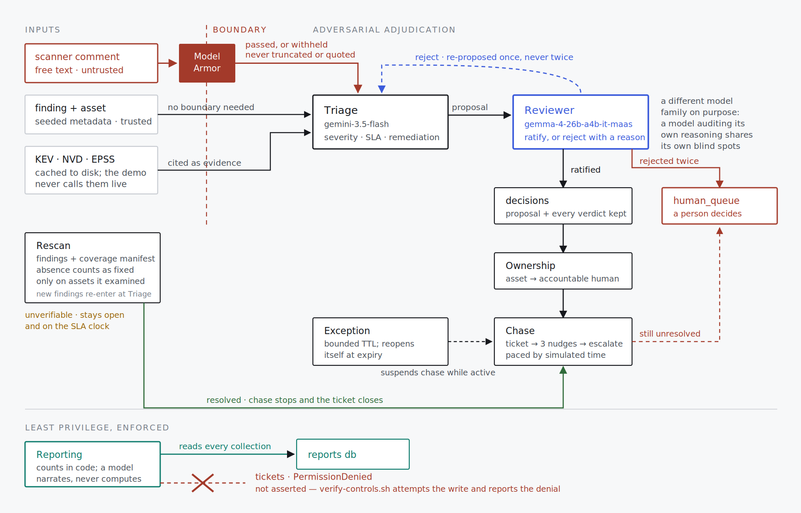

# Remediation Zero

An autonomous agent fleet that owns the vulnerability remediation lifecycle for a one-person security team.

Built for the All Things Agentic Hackathon, Fortified Enterprise Fleet track.

---

## The friction

Finding vulnerabilities is solved. Scanners do it well. What breaks a one-person security program is the six weeks *after* the scan: chasing owners who did not read the ticket, re-opening work that silently stalled, tracking risk acceptances that expired without anyone noticing, and rebuilding the same context from scratch every Monday morning.

That work is not intellectually hard. It is relentless, stateful, and spread across weeks — which is exactly the shape of work an agent fleet should carry and a human should not.

Remediation Zero is built for the analyst who *is* the security department. No SOC, no ticket triage tier, no program manager.

## What it does

A finding lands. From there, no human is in the loop until a decision needs one:

1. **Triage & Enrichment** proposes severity, SLA, and a remediation path, citing CISA KEV, NVD, and EPSS.
2. **Adversarial Reviewer** receives the proposal and the raw finding and must ratify it or reject it with a reason. Nothing commits without passing this gate.
3. **Ownership & Routing** maps the affected asset to an accountable human.
4. **Remediation Chase** opens the ticket and pursues it across weeks — nudging, escalating, and adapting to what has historically worked with that specific owner.
5. **Exception & Expiry** records risk acceptances with a TTL and re-opens them automatically when they lapse.
6. **Reporting** produces the weekly metrics the analyst would otherwise assemble by hand.

## Architecture



Design decisions worth calling out:

- **Cross-family adversarial review before commit.** A single reasoning agent that is confidently wrong produces a wrong SLA on a real vulnerability. Every triage decision is challenged before it becomes state by a reviewer agent running on Gemma rather than Gemini, because a model auditing its own reasoning shares its own blind spots. Disagreements are logged, capped at one retry, then routed to a human queue.
- **Idempotency keys on every side-effecting tool.** A long-running agent that resumes after a crash must not open the same ticket twice or send a fourth nudge as its first. Every mutation carries a deterministic key derived from finding ID, action type, and cycle.
- **Injectable clock.** All time reads go through a `SimClock` service. Documents carry both `real_ts` (wall clock, never falsified) and `sim_ts` (simulation). This lets a six-week remediation cycle be demonstrated in three minutes without fabricating evidence of elapsed time.
- **Least privilege per agent.** Each sub-agent runs under its own Agent Identity with IAM scoped to its own Firestore collections. The reporting agent cannot write tickets. This is enforced, not documented.
- **Two-layer injection defense.** Untrusted text — scanner comment fields, ticket replies, vendor advisories — passes Model Armor before entering any reasoning context, and the reviewer agent independently catches instruction-shaped content that slips through.
- **Dead-letter queue and circuit breakers.** Worker failures and reasoning loops degrade to a human queue rather than silently dropping findings.

## Tech stack

| Layer | Service |
|---|---|
| Model | Gemini 3.5 Flash (Gemini Enterprise Agent Platform) |
| Agent framework | Google Agent Development Kit (ADK) |
| Runtime | Agent Runtime — long-running orchestrator session |
| State | Firestore, Agent Platform Sessions |
| Long-term memory | Agent Platform Memory Bank |
| Governance | Agent Identity, Agent Registry, Model Armor |
| Telemetry | Cloud Trace, Cloud Logging (OpenTelemetry) |
| Events | Pub/Sub with dead-letter queue, Cloud Scheduler |
| Interface | Cloud Run |
| Reviewer model | Gemma — adversarial review, deliberately a different model family |

## Data sources

All vulnerability findings are **synthetic**. No production, employer, or third-party data is used anywhere in this project.

Enrichment queries real public sources: CISA Known Exploited Vulnerabilities catalog, NVD, and EPSS. Responses are cached locally so demos do not depend on third-party availability.

---

## Spin-up instructions

### Prerequisites

- Google Cloud project with billing enabled
- `gcloud` CLI authenticated
- Python 3.11+
- Terraform 1.6+ (optional — manual `gcloud` equivalents are in `docs/manual-setup.md`)

### 1. Clone and configure

```bash
git clone https://github.com/<you>/remediation-zero.git
cd remediation-zero
cp .env.example .env
```

Set in `.env`:

```
GOOGLE_CLOUD_PROJECT=your-project-id
GOOGLE_CLOUD_LOCATION=us-central1
MODEL_ID=gemini-3.5-flash
SIM_CLOCK_MODE=real          # or "sim" for accelerated demo
```

### 2. Enable APIs and provision infrastructure

```bash
./scripts/enable-apis.sh
terraform -chdir=infra init
terraform -chdir=infra apply
```

This provisions Firestore, Pub/Sub topics and the dead-letter queue, Cloud Scheduler, the per-agent service accounts with scoped IAM, and the Model Armor template.

### 3. Seed the synthetic corpus

```bash
python -m scripts.seed --findings 400 --assets 60 --owners 12
```

Includes one finding with a planted prompt-injection payload in its comment field, used to demonstrate the Model Armor and reviewer-agent defenses.

### 4. Run locally

```bash
pip install -r requirements.txt
adk run agents/orchestrator
```

The console UI is at `http://localhost:8080`.

### 5. Deploy

```bash
./scripts/deploy-agent.sh    # orchestrator + sub-agents to Agent Runtime
./scripts/deploy-ui.sh       # console to Cloud Run
```

The agent auto-registers in Agent Registry on deploy. Verify with:

```bash
gcloud alpha agent-registry agents list
```

### 6. Run a cycle

```bash
# Real time
./scripts/tick.sh

# Accelerated: replay six weeks of remediation lifecycle
SIM_CLOCK_MODE=sim ./scripts/tick.sh --advance-weeks 6
```

### 7. Tear down

```bash
terraform -chdir=infra destroy
```

### Cost notes

Minimum instances are set to zero and maximum instances are capped. If Gemma is served from a dedicated endpoint rather than pay-per-token, that endpoint is the only always-on component — deploy it only when needed and destroy it immediately after. Set a billing budget alert before running anything.

---

## Findings and learnings

*(Fill this in on Day 4. Judges read it. Be specific about what broke — the idempotency failure you hit, what the reviewer agent caught that triage got wrong, where Memory Bank helped and where it did not.)*

## Disclosure

Built entirely during the hackathon submission period. Implementation assisted by AI coding tools, as permitted by the rules. No pre-existing code was incorporated.
n
